# DYCMS file upload vulnerability

## Overview
DYCMS Open Source Version v2.0.9.41
## Vulnerability impact
DYCMS Open Source Version v2.0.9.41
## Vulnerability location
DYCMS has a file upload vulnerability, which is caused by the application only detecting the extension of image files in the front-end. Therefore, the extension can be modified during the data transmission process to bypass restrictions and upload arbitrary files.
## Vulnerability details
DYCMS has a file upload vulnerability, which is caused by the application only detecting the extension of image files in the front-end. Therefore, the extension can be modified during the data transmission process to bypass restrictions and upload arbitrary files.
## Vulnerability verify
  1. Write a 1.jpg file
 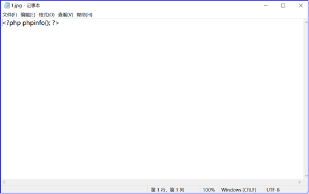
 2. Log in to the backend and navigate to the 'Article Management' module
 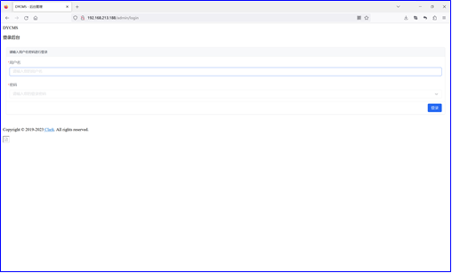
 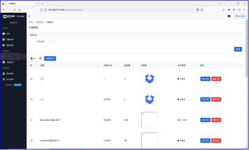
 3. Click the 'Add Article' button to open the 'Add Article' interface.
 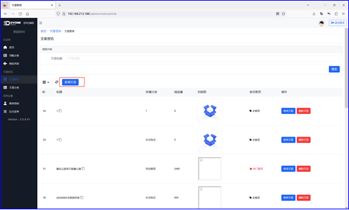
 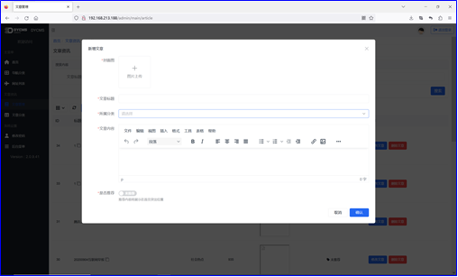
 4. Burpsuite settings interception
 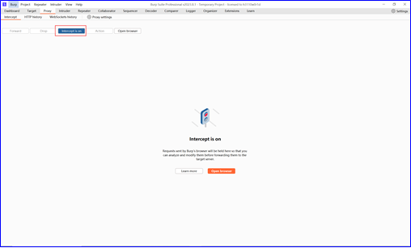
 5. Upload 1.jpg file
 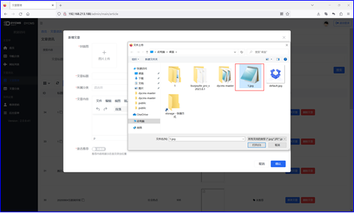
 6. Change the suffix jpg to php and send it
 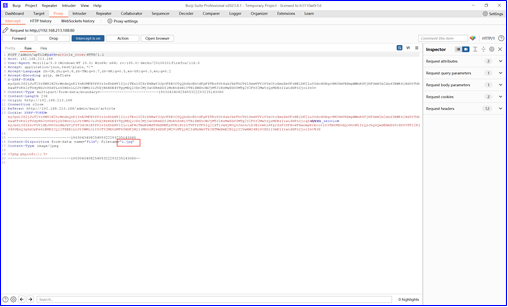
 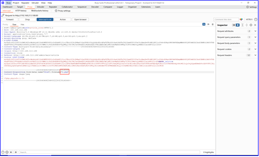
 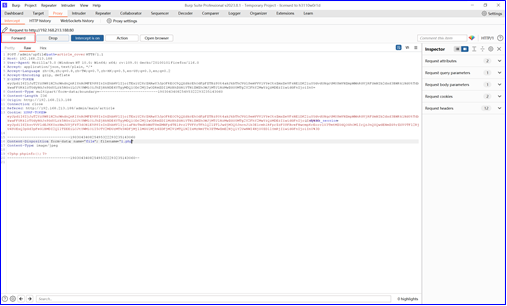
 7. View response data with the suffix 'php'
 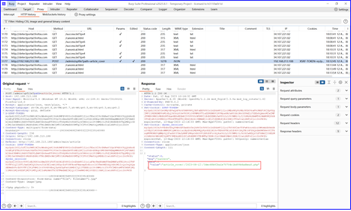
 8. Using x.x.x.x/store to concatenate paths and access, PHP code is executed at this point
 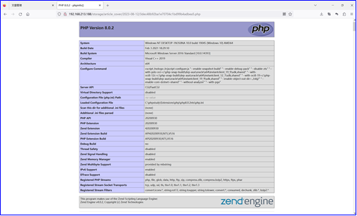