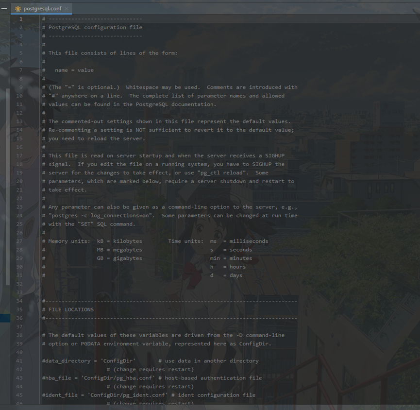
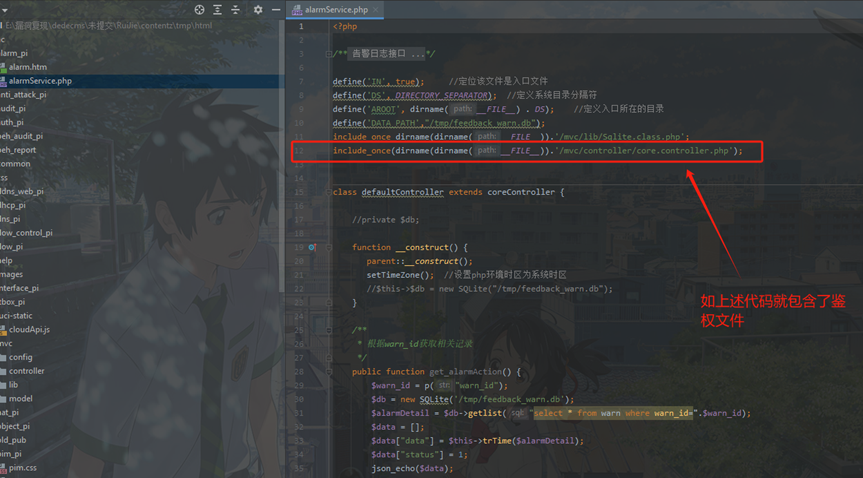
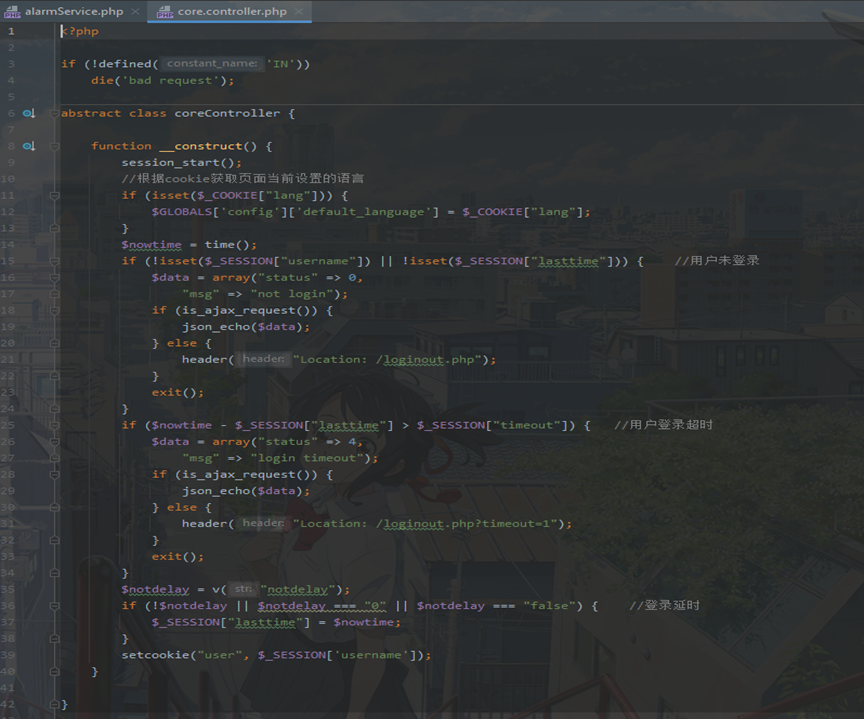
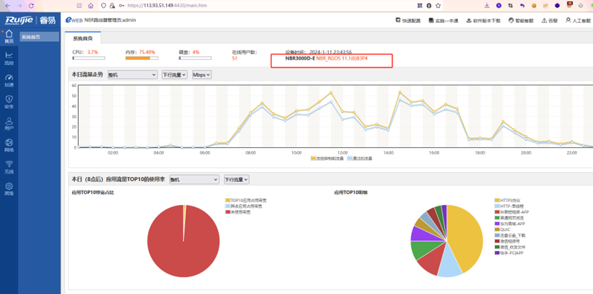
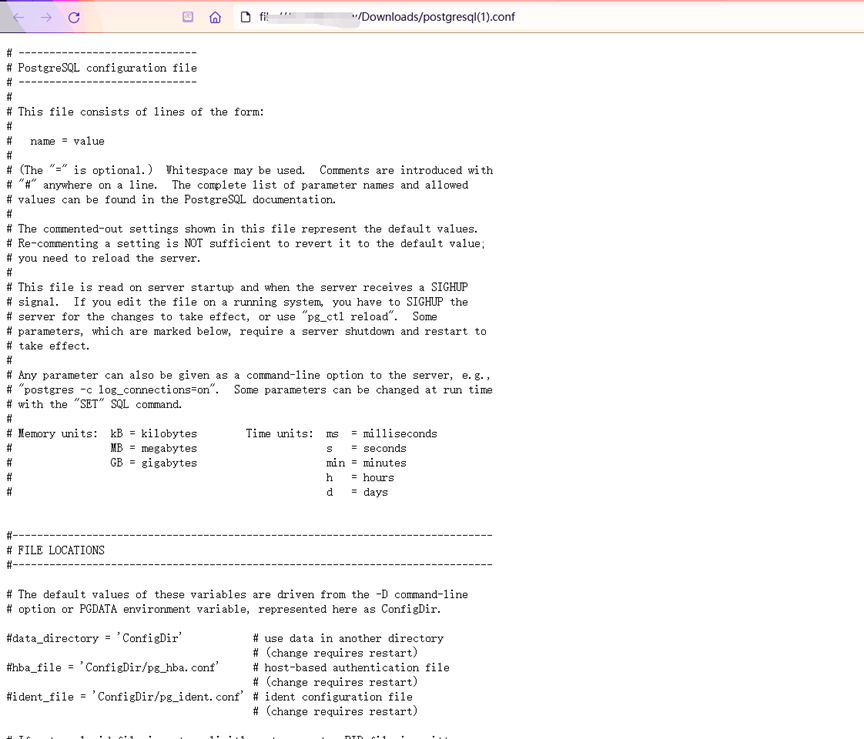

# Ruijie NBR3000D-E gateway has information leakage vulnerability

## Overview
Manufacturer's address：[(https://113.93.51.149:4430/main.htm)]
## Vulnerability impact
Ruijie NBR3000D-E gateway
## Vulnerability location
/tool/shell/postgresql.conf
## Vulnerability details
Ruijie Network is a professional network manufacturer with a full range of network equipment product lines and solutions, including switches, routers, software, security firewalls, wireless products, storage, and more. There is an information leakage vulnerability in the Ruijie NBR3000D-E gateway, which allows attackers to obtain server privileges and cause the server to crash 
## Vulnerability verify
[(https://113.93.51.149:4430/main.htm)]
 1.Code analysis
 The configuration file postgresql.exe has not been authenticated, resulting in direct access to the configuration file by the frontend.
 
 And the following code includes the authentication file mvc/controller/core.controller.php, as shown in the following figure:The function point containing authentication files requires login
 
 
 2.Vulnerability reproduction
 https://113.93.51.149:4430/main.htm
 The login interface is shown in the figure
 admin/lwd1012
 
 Accessing without logging in
 https://113.93.51.149:4430/tool/shell/postgresql.conf，You can view the PostgreSQL configuration file
 
 